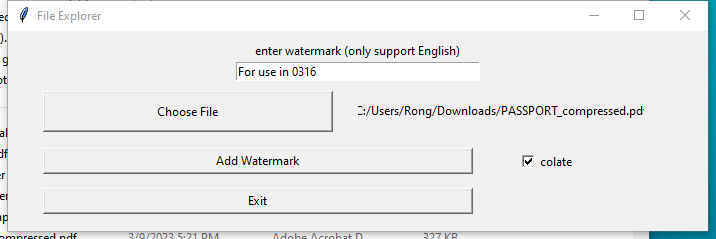

# PDFWatermarker
An open source compact PDF watermarker that is based on python

## A. Download

<button name="button" onclick="https://github.com/HaozheTian/PDFWatermarker/raw/main/dist/PDFWatermarker.exe">Download</button>

## B. Note

Check ``口colate`` so that the watermark cannot be removed (file size will be larger).